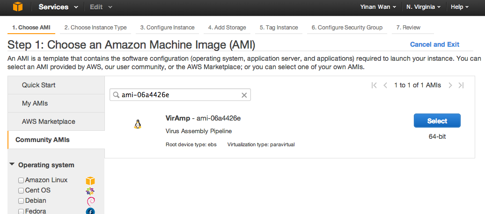
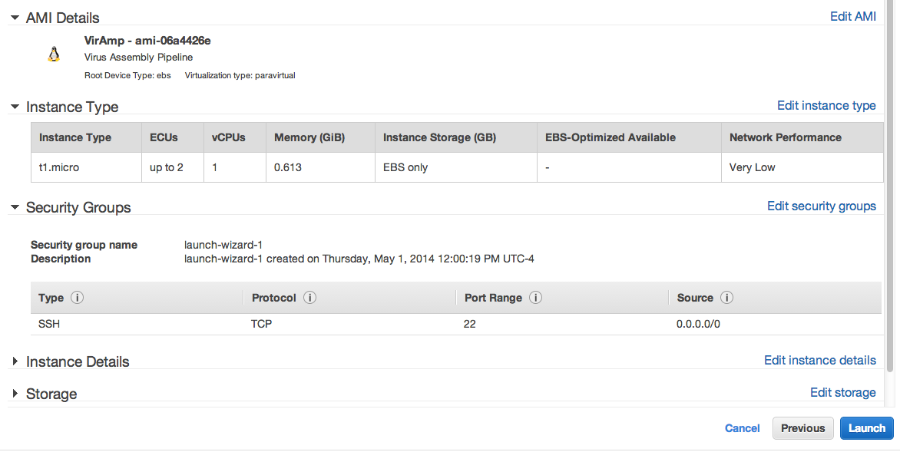
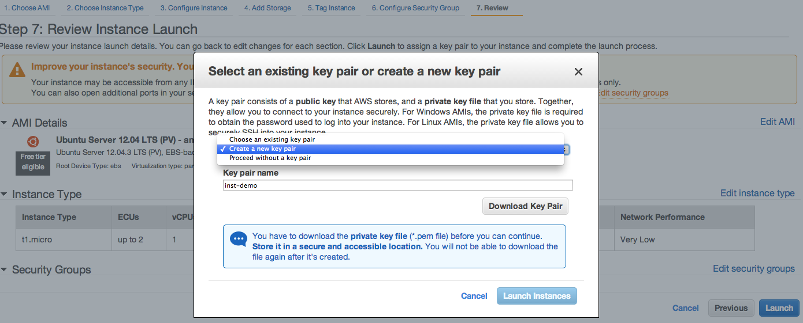

Setting up a EC2 instance
==========================

Go to http://aws.amazon.com/, in a Web browser.

Select 'My Account/Console' on the top right if you already have an account; otherwise sign up with a new account.

Go to the 'AWS Management Console' option, click the 'EC2' at upper left.

Before import the AMI, make sure you are in the right Availability zone. Amazon EC2 is hosted in multiple locations world-wide with multiple Availability zones, Resources cannot replicated across regions untill specified.  Our AMI is stored at region "US East(N. Virginia)". Check the upper right corner next to your account name, and make sure it's set at the right region. If not, just click and select the right one on the dropdown manual.

Click the blue button 'Launch Instance' at the mid-level of the page.

Step-1: Choosing the instance
-----------------------------

Click Community AMIs tab at mid-left and search the VirAmp AMI-id: "ami-06a4426e", or you can simply search "viramp"

Step-2: Review Instance type
-----------------------------

Choose a proper instance type, for trials, one can choose the free tier, but for serious usage, it is advised to select at least the m3.large (third option)

.. image:: viramp-doc/review-instance-type.png

Step-3: Launch the Instance
-----------------------------

Step-4: Create Key-pairs
-----------------------------

Congratulations you have successfully launched your own version of the instance.  For login and start the viramp version, please go to :ref:`VirAmp instance login <viramp_login_ref>`
