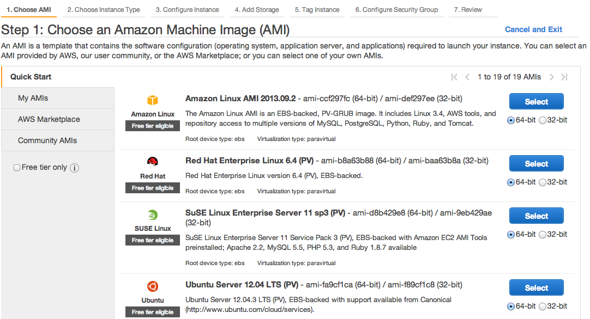
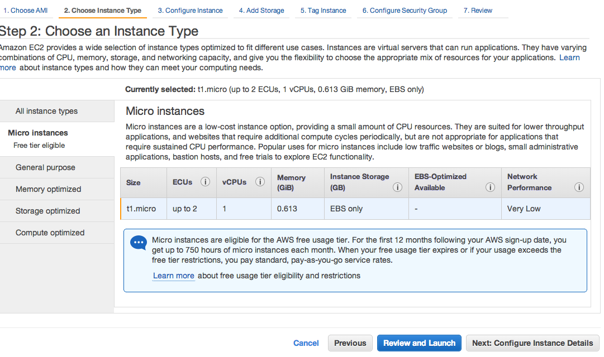
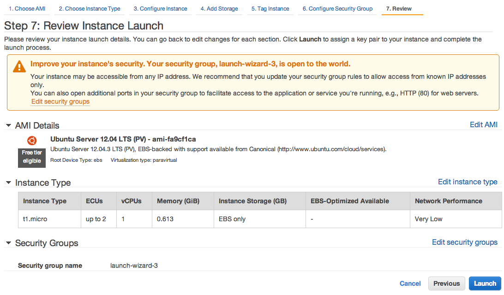

Setting up a EC2 instance
==========================

Go to http://aws.amazon.com/, in a Web browser.

Select 'My Account/Console' on the top right if you already have an account; otherwise sign up with a new account.

Go to the 'AWS Management Console' option, click the 'EC2' at upper left.

Click the blue button 'Launch Instance' at the mid-level of the page.

Step-1: Choosing the instance
-----------------------------

Step-2: Review Instance type
-----------------------------

Step-3: Launch the Instance
-----------------------------

Step-4: Create Key-pairs
-----------------------------
.. image:: viramp-doc/key-pair.png

Congratulations you have successfully launched your own version of the instance.  For login and start the viramp version, please go to :ref:`viramp_login`
