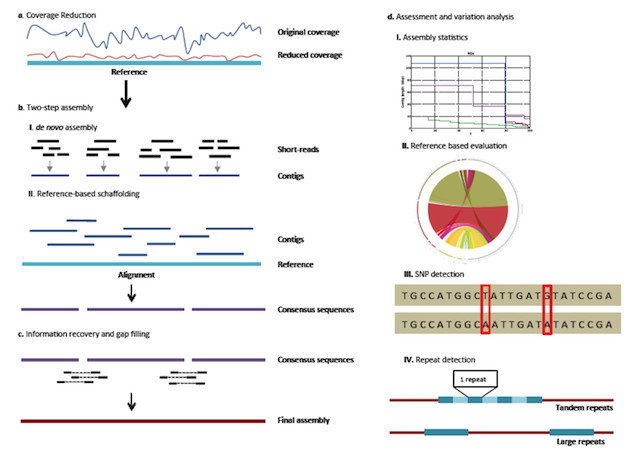

.. VirAmp documentation master file, created by
   sphinx-quickstart on Mon Mar 17 10:38:15 2014.
   You can adapt this file completely to your liking, but it should at least
   contain the root `toctree` directive.

Welcome to VirAmp's documentation!
==================================

VirAmp is a galaxy-based system for fast virus genome assembly and variation discovery.

Following is an overview of how VirAmp platform works:

**For VirAmp platform installation and usage on the Cloud:**

.. toctree::
        :maxdepth: 2

        ec2_import
        viramp_login
        viramp_intro
        variation_assess

**For install VirAmp on your local machine**

* Download an `Galaxy <http://galaxyproject.org/>`_ and follow the `installation instruction <https://wiki.galaxyproject.org/Admin/GetGalaxy>`_

* The Script/vamp directory contains all the scripts and galaxy tool config files, place the folder under galaxy-dist/tools.

* Place the tool_config.xml in config under 'galaxy-dist'.

* Proftpd configuration as in 'config/proftpd.conf'.

* To get everything running, your will need the following softwares installed:

	* `seqtk <https://github.com/lh3/seqtk>`_
	* `diginorm <http://ged.msu.edu/angus/diginorm-2012/tutorial.html>`_
	* `velvet <http://www.ebi.ac.uk/~zerbino/velvet/>`_
	* `AMOS <http://sourceforge.net/apps/mediawiki/amos/index.php?title=AMOS>`_
	* `Quast <http://bioinf.spbau.ru/quast>`_
	* `MUMmer <http://mummer.sourceforge.net/>`_
	* `Circos <http://circos.ca/>`_

