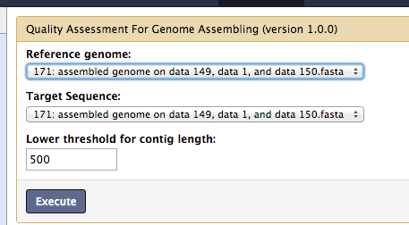
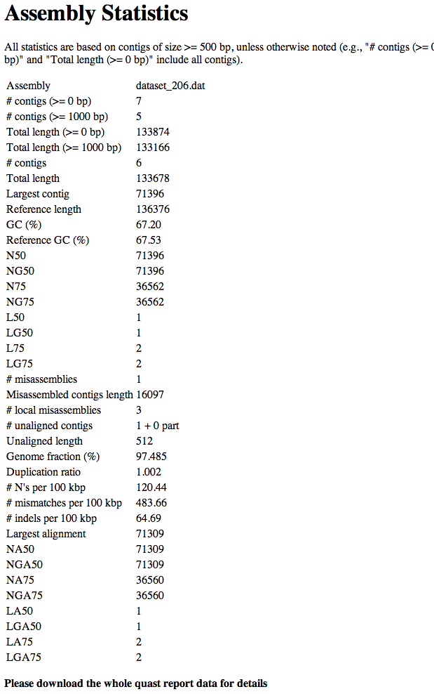
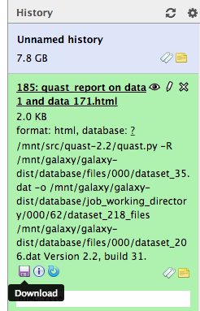
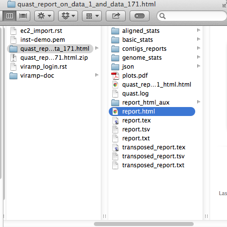
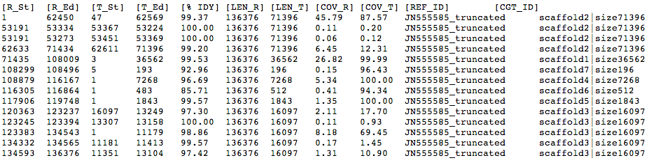
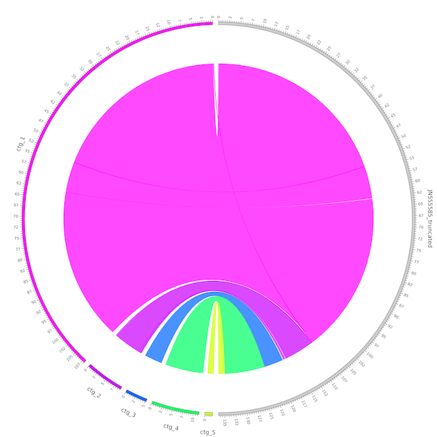
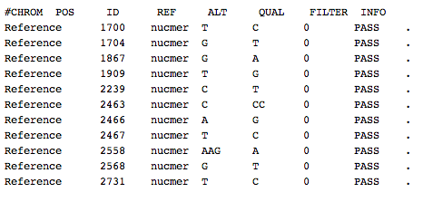
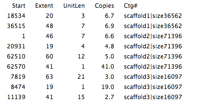

Post-Assembly Process: Assessment and Variation Analysis
=====================

VIRAmp not only provides all the process related with assembly, the platform also integrates multiple tools for post-assembly process, including quality assessment and variation analysis.

QUAST REPORT
------------

It is important to evaluate how robust the new assembly is, before feed into the downstream functional analysis.  VIRAmp first provides a report of common assembly evaluation metrics based on comparing with reference. A detailed `QUAST report <http://bioinf.spbau.ru/quast>`_ can be downloaded.

The input is the reference genome and new assembly.

Primary output is summary of common assembly evaluation metrics

Alternatively, a full report of QUAST report could be downloaded for more details.

Unzip and open the report at local folder

A demonstration of QUAST plot

.. image:: assess-pic/quast-demo.png

Assembly-Reference Alignment
----------------------------

VIRamp provide information of the difference between the reference and new assembly based on the MUMmer alignment.  Coordinates and percentage identity is provided for each aligned region between two sequences.  It helps the users to identify large INDELs as well as other complex structure and variations. Table 1 demonstrates an example of the comparison report.

Circos graph visualization
--------------------------

To help the users further understand the information provided above (Assembly-Reference Alignment), visualization is provided. Circos projects the assembled draft genome to the aligned part of reference, creating a straightforward visualization for large structural variation.

SNP analysis
-------------

With the alignment between assembly and reference, SNP information is also provided in VCF format.

Repeat and Tandem repeat analysis
---------------------------------

By aligning the assembly against itself, VIRAmp also provides repeat information, starting coordinates and length is provided based on the alignment.

BWA aligner
-----------

Besides all the specific tools listed above, general tools like `bwa <http://bio-bwa.sourceforge.net/>`_ is also provided for use based on users' own creation. 
