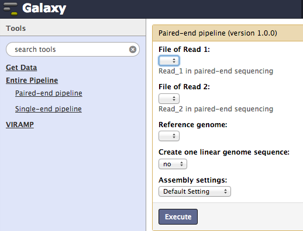
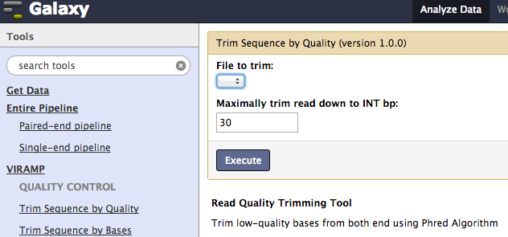
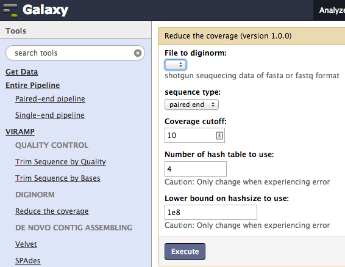
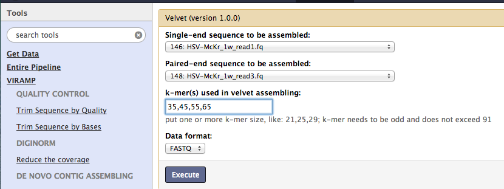
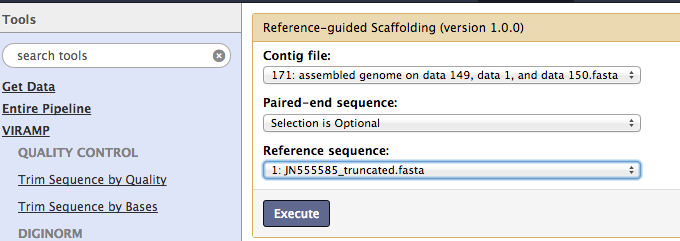
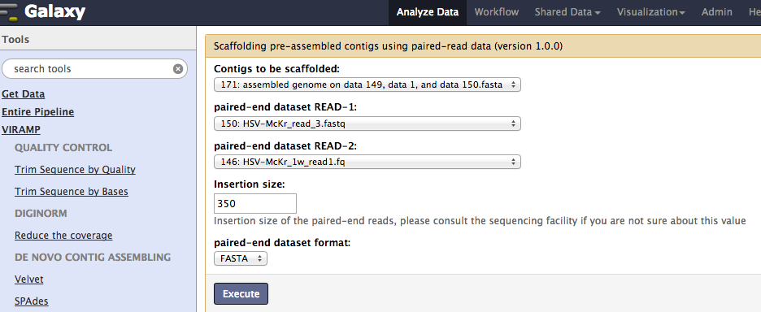
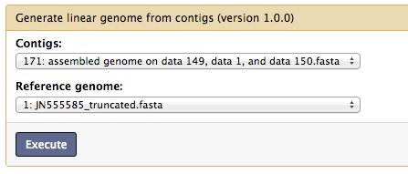

VIRamp assembly pipeline manual
================================

This is a general description of the function of each tool via `VIRAMP website <http://viramp.com:8080/>`_ or in your own version of platform. Detailed description is posted under the webpage of each tool.

One-click pipeline
-------------------
Two general pipelines are provided for a one-click options, for paired-end and single-end data individually.  Users only need to submit raw data of read files and reference file.  Besides running with the default settings, advanced setting is provided for user to config the pipelinconfig the pipeline.

Step-by-Step Process
---------------------

Next we provide an introduction of each step in the process individually.

Quality Control
^^^^^^^^^^^^^^^
Trim out low quality bases, the input file is the raw data in fastq format. A choice of either trim out low quality bases or mandatorily trim out certain length is provided.

Diginorm
^^^^^^^^^
Reduce coverage and bias using `Digital normalization <http://ged.msu.edu/papers/2012-diginorm/>`_, this step reduce the sample variation as well as sample bias.

`de novo` Contig assembly
^^^^^^^^^^^^^^^^^^^^^^^^^

Assembling the short reads into longer contigs, by default the **One-click pipeline** uses `velvet <https://www.ebi.ac.uk/~zerbino/velvet/>`_, two alternatives `SPAdes <http://bioinf.spbau.ru/spades>`_ and `VICUNA <http://www.broadinstitute.org/scientific-community/science/projects/viral-genomics/vicuna>`_ are provided.

Reference-based scaffolding
^^^^^^^^^^^^^^^^^^^^^^^^^^^

Assemble the contigs into longer `super-contigs`, this step is a modification from `AMOScmp <http://sourceforge.net/apps/mediawiki/amos/index.php?title=AMOScmp>`_ 

Reference-independent scaffolding
^^^^^^^^^^^^^^^^^^^^^^^^^^^^^^^^^

Super-contig extension and connection, this step is using `SSPACE <http://www.baseclear.com/landingpages/basetools-a-wide-range-of-bioinformatics-solutions/sspacev12/>`_.  At the end of this step, the pipeline will produce a draft genome, which is a multi-fasta usually contains 5~15 contigs, listed in the same order as the references.

Gap closing
^^^^^^^^^^^
This step connecting all the contigs in the multi-fasta from the previous step into one linear genome. This is for the convenience of downstream functional analysis especially for non-computational biologist.  But this is **optional** and highly recommended to be done after all the assessment of the draft genome, as the gaps between the contigs could from misassembly, sequencing, genome feature etc. 

