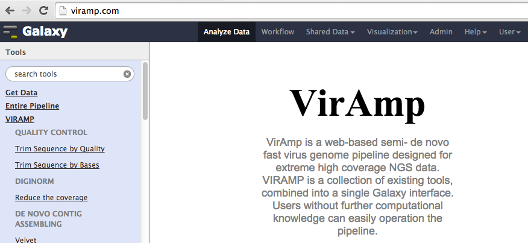
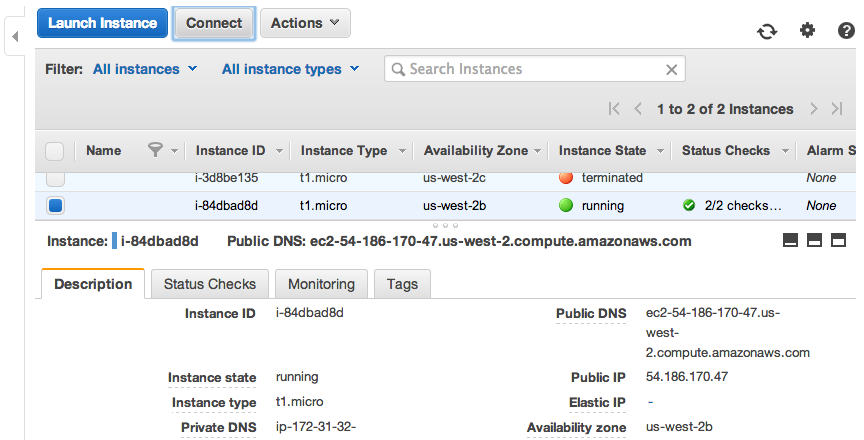
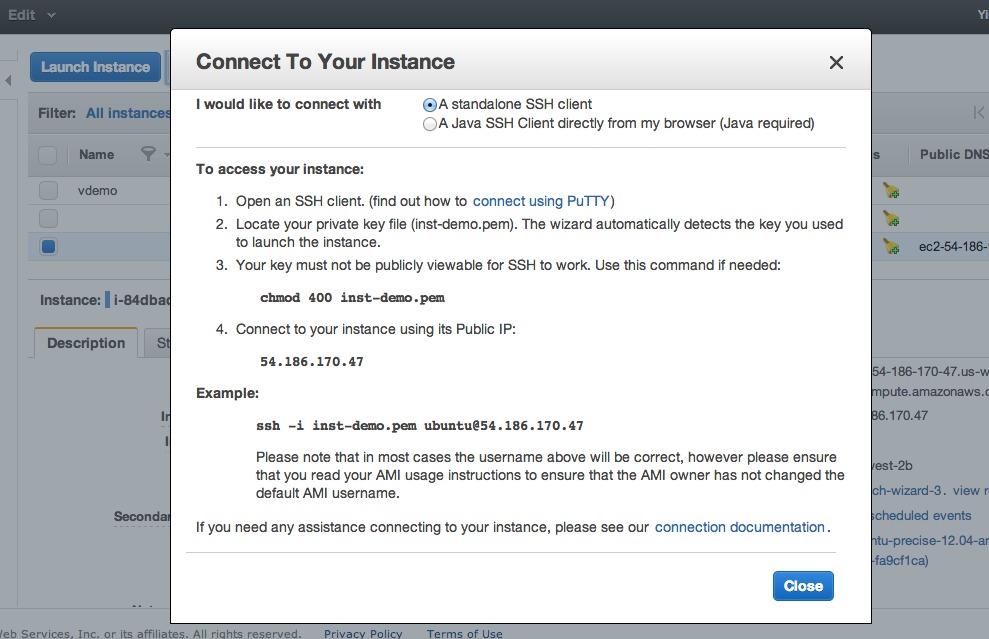

.. _viramp_login_ref:

Login to your VIRAMP instance and start the server
==================================================

At this point you have successfully owned your own version of VIRAMP instance, so what's next?

Start exploring the VIRamp platform
------------------------------------

Open viramp from browser, type in public_IP:8080 (for example, the demo is viramp.com:8080), which public_IP is the IP assigned to your instance, by default the server is open to public via port 8080

.. _inst_login_ref:

(optional) Log in to the new instance
--------------------------------------

Alternatively, for experienced users, one can also modify the system based on the the specific requirement.
 
An instruction and overview of the basic steps and parameters you need to login to the instance is provided at the console

Hit the "Connect" buttom to view information you need for login to the backend of the system

Start your terminal and type the following command:

        ``chmod 400 inst-demo.pem``

Connect to your instance using your public IP:

        ``ssh -i inst-demo.pem ubuntu@viramp.com``

Change to the galaxy directory:

        ``cd /mnt/galaxy/galaxy-dist/``

Change viramp settings:

        ``vi universe_wsgi.ini``

Start the viramp server:

        ``sh run.sh``

(optional) FTP configuration for large dataset uploading
----------------------------------------------

Galaxy's generic uploading function cannot handle files larger than 2GB properly.  Use FTP to upload data instead. ProFTPd has been preinstalled in the instance, and most of the configuration is already done, but users still may need to log in to the instance for some change.

* Log in to the instance with instructions showing at the :ref:`above section <inst_login_ref>`.

* Change to galaxy home directory
        ``cd /mnt/galaxy/galaxy-dist``

* Edit the config file (`universe_wsgi.ini`), change the `ftp_upload_site` parameter to the IP address of the instance.

* The FTP configuration file is located at `/usr/local/etc`. In general, it has been configed to fit in the system.  Only experienced users may want to modify for further adjustment

For more information about general ftp configuration on Galaxy, please visit the `Galaxy wiki <https://wiki.galaxyproject.org/Admin/Config/UploadviaFTP>`_
